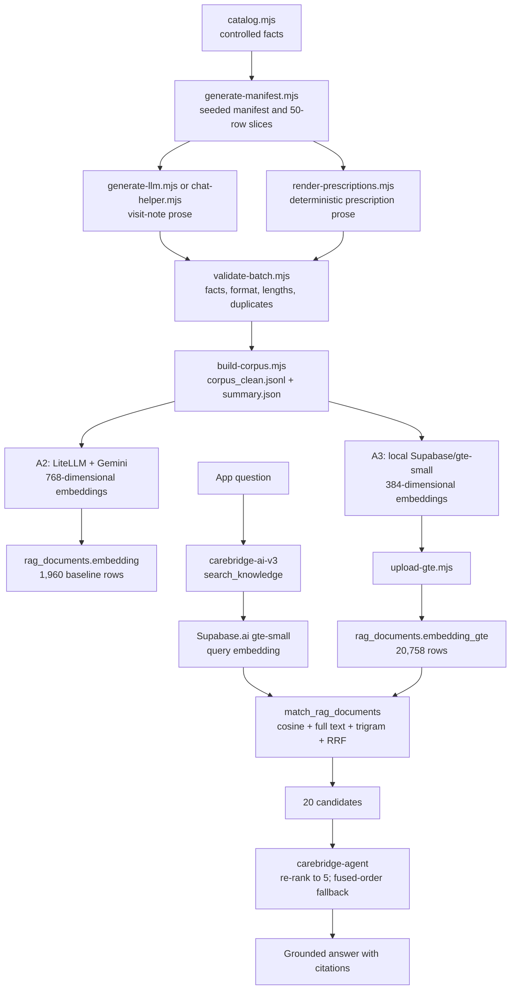

# CareBridge RAG and Predictive Evaluation

`carebridge-rag` contains the offline data and evaluation work for
[CareBridge](https://github.com/shahriar-rashid-13/carebridge-clinic-flow): a deterministic
synthetic clinic corpus, generation and validation tooling, two embedding pipelines, retrieval and
classification evaluations, and a separate no-show prediction study.

All patients, doctors, visits, prescriptions, and FAQs in the RAG corpus are fictional. The only
real-world data used here is the public, anonymised Kaggle no-show dataset; it is processed locally
and is never loaded into CareBridge or Supabase.

## Project links

- [Live clinic app](https://carebridge-clinic-flow.vercel.app)
- [Clinic app repository](https://github.com/shahriar-rashid-13/carebridge-clinic-flow)
- [LiteLLM gateway repository](https://github.com/shahriar-rashid-13/carebridge-liteLLM)
- [Assessment 2 report](https://github.com/shahriar-rashid-13/carebridge-clinic-flow/blob/main/docs/assessment-2/ASSESSMENT_2_REPORT.md)
- [Assessment 3 report](https://github.com/shahriar-rashid-13/carebridge-clinic-flow/blob/main/docs/assessment-3/ASSESSMENT_3_REPORT.md)
- [Complete project report](https://github.com/shahriar-rashid-13/carebridge-clinic-flow/blob/main/docs/FINAL_PROJECT_REPORT.md)
- [Project overview](https://github.com/shahriar-rashid-13/carebridge-clinic-flow/blob/main/docs/PROJECT_OVERVIEW.md)

## Architecture and data flow



The production table, indexes, RLS policies, and search RPC live in the clinic app repository:
[gte-small migration](https://github.com/shahriar-rashid-13/carebridge-clinic-flow/blob/main/supabase/migrations/20261005000000_rag_gte_small.sql),
[indexed search migration](https://github.com/shahriar-rashid-13/carebridge-clinic-flow/blob/main/supabase/migrations/20261005010000_rag_search_use_indexes.sql),
and [v3 knowledge tool](https://github.com/shahriar-rashid-13/carebridge-clinic-flow/blob/main/supabase/functions/carebridge-ai-v3/tools-knowledge.ts).

Assessment 2 used LiteLLM model group `carebridge-embed`, backed by
`gemini-embedding-001`, to create 768-dimensional vectors. Quota limited the evaluated index to
1,960 rows: all 230 accepted FAQs and 1,730 prescriptions. Those vectors remain in `embedding`.

Assessment 3 embeds the full corpus locally with `Supabase/gte-small` through Transformers.js.
Mean-pooled, normalised 384-dimensional vectors are uploaded to `embedding_gte`. At query time,
the Edge runtime uses the same model through `Supabase.ai`, avoiding an external embedding quota.
The recorded `check-gte.mjs` run compared 20 local and Edge embeddings and passed at cosine 1.000.

Production search uses a 0.82 cosine cutoff, full-text search, trigram similarity, and
reciprocal-rank fusion. AI v3 requests 20 candidates and re-ranks them to five. If re-ranking
fails or exceeds its six-second production budget, fused order is retained. The app removes
medicine amounts from other patients' records before answering.

## Corpus

The manifest contains 20,850 intended records in 417 slices. The final validated corpus contains:

| Record type | Accepted |
|---|---:|
| Visit notes | 11,028 |
| Prescriptions | 9,500 |
| FAQs | 230 |
| **Total** | **20,758** |

The records span 12 specializations. Of the accepted rows, 13,208 contain LLM-written prose and
7,550 were rendered by script. There are 20,638 searchable rows. The other 120 are doctor-specific
FAQs about fictional catalog doctors; `build-corpus.mjs` marks them `rag_visible = false` so the
app uses its live doctors table.

`corpus/summary.json` records 94 excluded output entries. Two are malformed extra rows that were
not in the manifest, so the accepted total is 92 below the 20,850 manifest records. The summary
lists every exclusion and reason.

The manifest is generated in two deterministic phases:

- A2 base, seed `20260929`: 2,700 visits, 2,300 prescriptions, and 250 FAQs.
- A3 extension, seed `20261002`: 8,400 visits and 7,200 prescriptions, with new patients and no
  reused doctor slots, anchors, or patient names.

Patient, doctor, date, diagnosis, regimen, difficulty, and unique occupation/context/vital anchors
are fixed before prose generation. The validator checks identifiers, headers, required facts,
medicines, plans, lengths, and near-duplicates. Later fix CSVs override earlier failed rows.
`build-corpus.mjs` re-validates every slice, excludes failures, joins text to manifest metadata,
and writes `corpus/corpus_clean.jsonl`.

All 20,758 rows have gte-small vectors. Median input length is 169 tokens. One record,
`VN-002828`, has 547 tokens and is truncated to the model's 512-token limit.

## Setup

### Node

Use Node.js 22 or newer from the repository root:

```bash
npm install
```

The dependency is `@huggingface/transformers`. The first local embedding run downloads the
approximately 30 MB gte-small model; later runs use the model cache.

### Environment variables

Create a gitignored `.env` only for commands that need remote services:

```dotenv
SUPABASE_URL=https://<project-ref>.supabase.co
SUPABASE_SERVICE_ROLE_KEY=<sb_secret_... or legacy service-role JWT>
LITELLM_BASE_URL=https://carebridge-lite-llm.vercel.app
LITELLM_MASTER_KEY=<gateway master key>
GEMINI_API_KEY=<Google AI API key>
GEMINI_MODELS=gemini-3.5-flash,gemini-3.5-flash-lite,gemini-3.1-flash-lite,gemma-4-31b-it
SEED_DOCTOR_PASSWORD=<minimum-eight-character-seed-password>
```

- Supabase variables: upload, retrieval evaluation, embedding parity check, and doctor seeding.
- LiteLLM variables: A2 embedding, Gemini RAG evaluation, LLM classification, and v3 evaluation.
- `GEMINI_API_KEY`: direct prose generation. `GEMINI_MODELS` optionally overrides its fallback list.
- `SEED_DOCTOR_PASSWORD`: only when `seed-doctors.mjs --apply` must create accounts.

The service-role key is a server secret, not an anon/publishable key. It bypasses RLS and must
never be exposed to a browser, logged, or committed. Only trusted local ingestion and evaluation
commands should receive it. Authenticated app users can read only visible, non-noise rows and
cannot write RAG data. `.env*`, embeddings, caches, virtual environments, and no-show data are
gitignored.

### Python environments

Classification uses a root environment:

```powershell
py -3 -m venv .venv
.\.venv\Scripts\python -m pip install -r requirements-eval.txt
.\.venv\Scripts\python scripts\classify-eval.py
```

No-show analysis uses a separate environment:

```powershell
cd noshow
py -3 -m venv .venv
.\.venv\Scripts\python -m pip install -r requirements.txt
.\.venv\Scripts\python train.py
# or: .\.venv\Scripts\jupyter notebook noshow.ipynb
```

Download [Medical Appointment No Shows](https://www.kaggle.com/datasets/joniarroba/noshowappointments)
to `noshow/data/KaggleV2-May-2016.csv`. See
[`noshow/RUN_NOTEBOOK.md`](noshow/RUN_NOTEBOOK.md) for notebook instructions.

## Commands and scripts

Run Node commands from the repository root.

### Generate, validate, and build

```bash
node scripts/generate-manifest.mjs

node scripts/generate-llm.mjs
node scripts/generate-llm.mjs --limit 1
node scripts/generate-llm.mjs --from B20 --limit 10
node scripts/generate-llm.mjs --only B12-M01
node scripts/generate-llm.mjs --models gemini-3.5-flash,gemini-3.1-flash-lite --pace 8000 --fixes 2 --chunk 25

node scripts/chat-helper.mjs status
node scripts/chat-helper.mjs next B12
node scripts/chat-helper.mjs copy B12-M03
node scripts/chat-helper.mjs save
node scripts/chat-helper.mjs fix
node scripts/chat-helper.mjs savefix

node scripts/render-prescriptions.mjs
node scripts/render-prescriptions.mjs B08-M08 B08-M09
node scripts/validate-batch.mjs
node scripts/validate-batch.mjs B01-M01
node scripts/build-corpus.mjs
```

`generate-manifest.mjs` writes deterministic facts and 50-row inputs. `generate-llm.mjs` defaults
to incomplete visit-note slices from B12, retries missing rows, and performs two fix rounds.
`chat-helper.mjs` is the Windows clipboard alternative. Named prescription slices are overwritten;
without names, only empty prescription slices are rendered. Validation exits 1 on errors. The
build always re-validates before merging.

`catalog.mjs` (controlled vocabulary) and `csv.mjs` (RFC 4180 helpers) are imported modules and
have no standalone commands.

### Embed and upload

Assessment 2 / Gemini:

```bash
node scripts/embed-upload.mjs --limit 100
node scripts/embed-upload.mjs --batch 50 --pace 31000
node scripts/embed-upload.mjs --force
```

Options: `--limit N`, `--batch N` (default 50), `--pace MS` (default 700), and `--force`.
Existing vectors are skipped unless forced. HTTP 429/5xx responses use backoff; repeat an
interrupted command to resume.

Assessment 3 / local gte-small:

```bash
node scripts/embed-gte.mjs --limit 100
node scripts/embed-gte.mjs --batch 32
node scripts/embed-gte.mjs --force
node scripts/upload-gte.mjs --limit 100
node scripts/upload-gte.mjs --batch 200
node scripts/check-gte.mjs
```

`embed-gte.mjs` supports `--limit N`, `--batch N` (default 32), and `--force`, writing resumable
JSONL. `upload-gte.mjs` supports `--limit N` and `--batch N` (default 200), upserts by `doc_id`,
and does not overwrite A2 vectors. `check-gte.mjs` requires the deployed `embed-check` function.

### Evaluate

```bash
node scripts/rag-eval.mjs --model gemini --seed-noise
node scripts/rag-eval.mjs --model gte
node scripts/rag-eval.mjs --model gte --cutoff 0.82
node scripts/rag-eval.mjs --model gte --sweep 0.78,0.80,0.82,0.84
node scripts/rag-eval.mjs --model gte --dry-run
node scripts/search-eval-v3.mjs --pace 4000

.\.venv\Scripts\python scripts\classify-eval.py
node scripts/classify-llm.mjs --per-class 10
.\.venv\Scripts\python scripts\classify-eval.py

.\noshow\.venv\Scripts\python noshow\train.py
```

`rag-eval.mjs` defaults to Gemini; default cutoffs are 0.55 for Gemini and 0.80 for gte-small.
The production-aligned v3 report uses 0.82. `--seed-noise` creates 100 typo duplicates, 100 junk
rows, and 100 off-topic rows, visible only to the service role.

`search-eval-v3.mjs` uses `carebridge-agent` for re-ranking/answers and the separate
`carebridge-judge` group for scoring. Replies are cached in `eval/.cache/search-eval-v3.json`.
It imports policy files from the sibling `carebridge-clinic-flow` checkout, so preserve that
layout or update `OKF_MODULE`.

Run `classify-eval.py` before `classify-llm.mjs` to create the held-out cache, then again afterward
to add the LLM results to the report.

### Seed catalog doctors

```bash
node scripts/seed-doctors.mjs
node scripts/seed-doctors.mjs --apply
node scripts/seed-doctors.mjs --remove
```

The default is a dry run. `--apply` creates/synchronises 36 synthetic accounts. `--remove` deletes
unused seeded accounts and deactivates seeded doctors with patient records. These are privileged
mutations; verify the target project and dry-run output first.

## Evaluation results

### Retrieval

The suite has 30 matching queries, 25 answerable edge queries, five out-of-scope edge queries, and
30 deterministic noisy variants. Metrics are Hit@5, MRR, P@5, and noise share.

| Variant | Set | Hit@5 | MRR | P@5 |
|---|---|---:|---:|---:|
| A2 Gemini hybrid, 1,960 rows | Matching | 1.00 | 1.00 | 0.47 |
| A2 Gemini hybrid, 1,960 rows | Edge | 0.96 | 0.94 | 0.54 |
| A2 Gemini hybrid, 1,960 rows | Noisy | 0.97 | 0.97 | 0.45 |
| A3a gte-small hybrid, 20,758 rows | Matching | 1.00 | 0.97 | 0.56 |
| A3a gte-small hybrid, 20,758 rows | Edge | 0.88 | 0.88 | 0.62 |
| A3a gte-small hybrid, 20,758 rows | Noisy | 0.87 | 0.79 | 0.49 |
| A3b 20-to-5 re-ranked | Matching | 1.00 | 1.00 | 0.63 |
| A3b 20-to-5 re-ranked | Edge | 0.92 | 0.92 | 0.62 |
| A3b 20-to-5 re-ranked | Noisy | 0.90 | 0.90 | 0.57 |

A3b returned nothing for all five out-of-scope queries. Re-ranking fell back for zero matching,
three edge, and one noisy query. On the same 1,960 rows with dense search only, Gemini/gte-small
Hit@5 was 1.00/1.00 matching, 1.00/0.92 edge, and 1.00/0.90 noisy.

Both A2 and A3b answers scored 5.00/5.00 faithfulness and relevance on 30 judged queries. On 15
policy questions, RAG-only answers scored 3.14/5 (6 fully correct, 5 contradictions); reviewed OKF
files scored 4.73/5 (14 fully correct, 1 contradiction). Clinic rules therefore use OKF files.

Injected noise shows why ingestion filtering matters: A2 noisy-query Hit@5 fell from 0.97 clean to
0.47 with 300 noise rows included.

- [`eval/RAG_EVAL_REPORT.md`](eval/RAG_EVAL_REPORT.md): A2 Gemini, hybrid/keyword, and noise.
- [`eval/RAG_EVAL_REPORT_GTE.md`](eval/RAG_EVAL_REPORT_GTE.md): A3 gte-small equivalent.
- [`eval/SEARCH_EVAL_V3_REPORT.md`](eval/SEARCH_EVAL_V3_REPORT.md): comparisons, re-ranking,
  judged answers, and policies.

### Classification

The published [`eval/CLASSIFICATION_REPORT.md`](eval/CLASSIFICATION_REPORT.md) records 100.0%
grouped held-out accuracy and 98.4% stress accuracy for TF-IDF plus logistic regression; outside
accuracy was 97.9% on routing FAQs and 79.2% on hand-written descriptions. Zero-shot
`carebridge-agent` scored 89.6% on hand-written descriptions and 88.3% on 120 stress notes.

**Caveat:** this is a stale A2 report based on 2,580 accepted visit notes (2,064 train, 516 test),
not the current 11,028-note corpus. The script now reads every visit note in
`corpus_clean.jsonl`; rerunning it would produce a new split and overwrite the report. These
metrics are valid only for the recorded A2 run and are not full-corpus A3 results.

### No-show prediction

The study uses 110,516 cleaned appointments from Vitória, Brazil (April-June 2016), with a
chronological train/validation/test split and earlier-day-only history features. The test set has
26,449 rows and an 18.5% no-show rate.

| Model | Threshold | Precision | Recall | F1 | PR-AUC | ROC-AUC |
|---|---:|---:|---:|---:|---:|---:|
| Earlier-no-show rule | — | 0.247 | 0.266 | 0.256 | — | — |
| Logistic regression, tuned | 0.231 | 0.290 | 0.782 | 0.423 | 0.334 | 0.724 |
| Gradient boosting, tuned | 0.246 | 0.307 | 0.679 | 0.423 | 0.349 | 0.735 |

Gradient boosting is preferred: slightly better PR-AUC and 40.8% flagged versus logistic
regression's 49.7%. Its modest precision supports reminders, not penalties or automatic
overbooking. See [`noshow/NOSHOW_REPORT.md`](noshow/NOSHOW_REPORT.md).

## Repository map

| Path | Purpose |
|---|---|
| `corpus/` | Final JSONL corpus and exclusion/count summary |
| `manifest/` | Seeded facts, batches, and LLM input slices |
| `output/` | Generated CSVs, fixes, validation reports, rendered-slice registry |
| `embeddings/` | Generated, gitignored gte-small vectors and report |
| `docs/SPEC.md` | Original rules; some headline counts predate A3 |
| `docs/GENERATION_PROMPT.md` | Prose-generation contract |
| `docs/RAG_PLAN.md` | Historical A2 implementation plan |
| `scripts/catalog.mjs`, `scripts/csv.mjs` | Controlled data and CSV helpers |
| `scripts/generate-manifest.mjs` | Deterministic A2/A3 facts |
| `scripts/generate-llm.mjs`, `scripts/chat-helper.mjs` | Automated/manual prose generation |
| `scripts/render-prescriptions.mjs` | Scripted prescription prose |
| `scripts/validate-batch.mjs`, `scripts/build-corpus.mjs` | Validation and final merge |
| `scripts/embed-upload.mjs` | A2 Gemini embedding/upload |
| `scripts/embed-gte.mjs`, `scripts/upload-gte.mjs`, `scripts/check-gte.mjs` | A3 embedding pipeline |
| `scripts/rag-eval.mjs`, `scripts/search-eval-v3.mjs` | Retrieval evaluations |
| `scripts/classify-eval.py`, `scripts/classify-llm.mjs` | Classification evaluations |
| `scripts/seed-doctors.mjs` | Privileged synthetic-doctor utility |
| `eval/` | Labels, raw results, and reports |
| `noshow/` | Training code, notebook, results, and report |

## Reproducibility

1. Install Node and both Python environments.
2. Rebuild the seeded manifest.
3. Generate/render prose, validate all slices, and build the corpus.
4. Compare `corpus/summary.json` with the committed summary. Manifest facts and scripted
   prescriptions are deterministic; fresh LLM prose need not be byte-identical.
5. Embed locally, check Edge parity, and upload to a correctly migrated Supabase project.
6. Run retrieval evaluation with the sibling clinic repository available for policy imports.
7. Run classical classification, LLM classification, then classical classification again.
8. Download the uncommitted Kaggle CSV and run the no-show script or notebook.

Model replies and query embeddings are cached. Embedding generation is append-only and resumable;
Supabase upserts use `doc_id`, preventing duplicate rows on retries.

## Known limitations

- This synthetic, constrained corpus is not a clinical reference or medical advice.
- Hidden doctor FAQs must never replace live doctor data.
- A2 covers 1,960 rows. Only the same-row dense track isolates embedding model from corpus scale.
- gte-small provides local quota-free coverage but trails Gemini on short edge/noisy queries.
- One long record is truncated at 512 tokens.
- LLM-as-judge scores can be biased despite using a separate judge model.
- Remote evaluations require matching migrations, Edge Functions, gateway, and sibling checkout.
- Classification results remain tied to the stale 2,580-note A2 snapshot until reviewed again.
- The no-show model uses six weeks of 2016 Brazilian data and needs local retraining/calibration.
- Free-tier model quotas and transient gateway failures can affect generation and evaluation.
